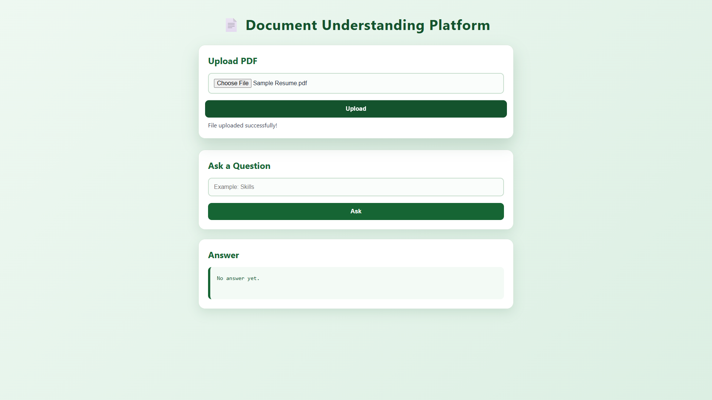
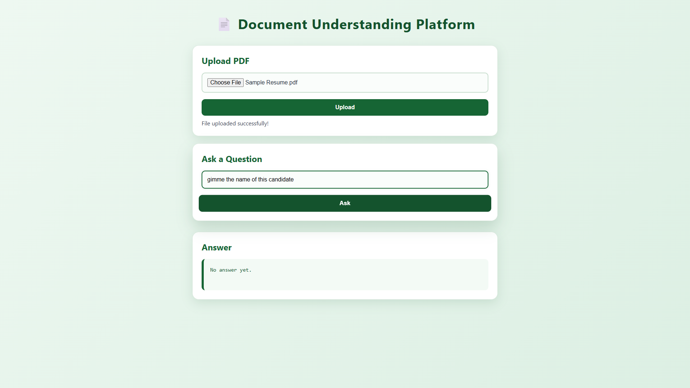
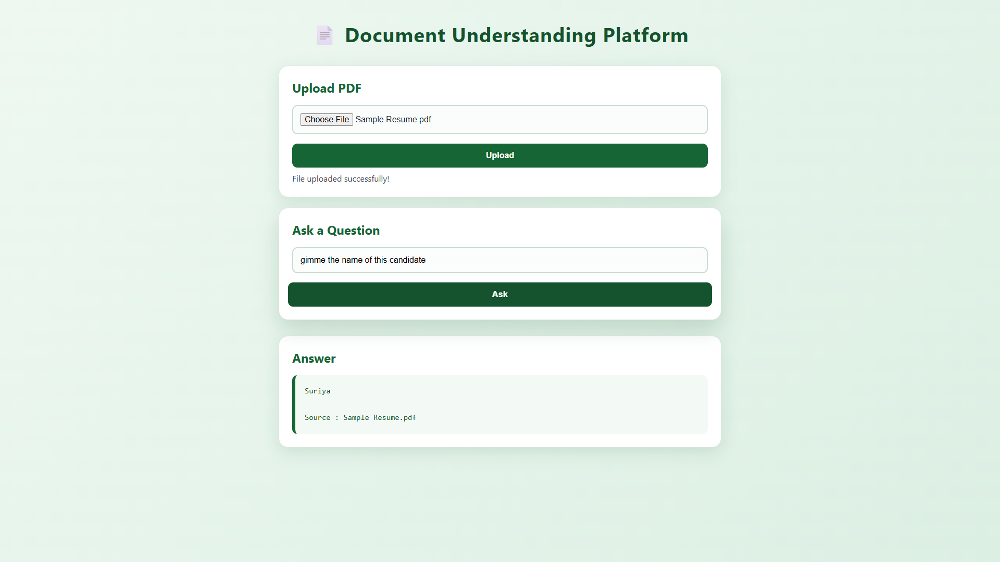

# 📑 DocuMind AI

An AI-powered document understanding platform that allows users to upload PDF documents and ask questions about their contents using Large Language Models (LLMs).

Built with **FastAPI**, **Groq API**, **Llama 3.3 70B**, **HTML**, **CSS**, and **JavaScript**.

---

## 🚀 Features

- 📄 Upload PDF documents
- 📖 Extract text from uploaded PDFs
- 🤖 Ask questions in natural language
- 🧠 AI answers using only the uploaded document
- ⚡ Fast inference powered by Groq
- 🎨 Clean and responsive user interface

---

## 🛠 Tech Stack

### Frontend
- HTML5
- CSS3
- JavaScript

### Backend
- FastAPI
- Python

### AI Model
- Groq API
- Llama 3.3 70B Versatile

### PDF Processing
- PyPDF

---

## 📂 Project Structure

```
document-understanding-platform/
│
├── backend/
│   ├── main.py
│   ├── test.py
│   ├── uploads/
│   └── __pycache__/
│
├── frontend/
│   ├── index.html
│   ├── style.css
│   └── script.js
│
├── uploads/
├── venv/
├── .env
├── README.md
└── requirements.txt
```

---

## ⚙ Installation

### Clone the repository

```bash
git clone https://github.com/yourusername/document-understanding-platform.git
```

```
cd document-understanding-platform
```

---

### Create Virtual Environment

Windows

```bash
python -m venv venv
```

Activate

```bash
venv\Scripts\activate
```

---

### Install Dependencies

```bash
pip install -r requirements.txt
```

or

```bash
pip install fastapi uvicorn groq pypdf python-dotenv python-multipart
```

---

## 🔑 Configure API Key

Create a **.env** file in the project root.

```
GROQ_API_KEY=your_groq_api_key_here
```

---

## ▶ Run the Backend

```bash
uvicorn backend.main:app --reload
```

Backend URL

```
http://127.0.0.1:8000
```

---

## 🌐 Run the Frontend

Simply open

```
frontend/index.html
```

in your browser.

---

## 💡 How to Use

1. Upload a PDF document.
2. Wait for the upload confirmation.
3. Enter a question related to the uploaded document.
4. The AI generates an answer based only on the uploaded document.
5. The source document is also displayed.

---

## 📸 Screenshots

### Home Page



### Upload PDF



### AI Answer



> Replace the image paths with your own screenshots.

---

## 📌 API Endpoints

### Home

```
GET /
```

Returns server status.

---

### Upload PDF

```
POST /upload
```

Uploads a PDF document.

---

### Read PDF

```
GET /read/{filename}
```

Returns the extracted text.

---

### Ask Question

```
POST /ask
```

Request

```json
{
    "question":"What are the candidate's skills?"
}
```

Response

```json
{
    "answer":"Python, Java, SQL...",
    "source":["Sample Resume.pdf"]
}
```

---

## 📈 Future Improvements

- Multiple document support
- Chat history
- Authentication
- Dark mode
- Document summarization
- Keyword highlighting
- OCR for scanned PDFs
- Drag and drop uploads
- Streaming AI responses

---

## 👨‍💻 Author

**Suriya**

AI & ML Student

Aspiring Software Engineer

GitHub: https://github.com/yourusername

LinkedIn: https://linkedin.com/in/yourprofile

---

## 📄 License

This project is licensed under the MIT License.

---

## ⭐ Support

If you found this project useful, consider giving it a ⭐ on GitHub.